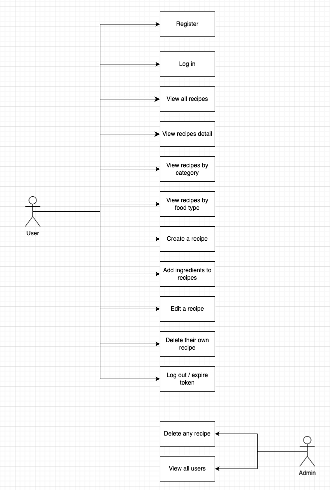

# 🍎 Healthy Recipe API 🍏

REST API built with Java and Spring Boot for managing healthy recipes. Allows users to create accounts, add recipes with their ingredients, and categorize them by food type and category.

---

##  Technologies Used

- Java 21
- Spring Boot
- Spring Data JPA
- MySQL
- Lombok
- Spring Security + JWT
- Postman (for testing)

---
## Diagarams

### Draft Diagram



### Final Diagram
<div class="sl-block is-focused" data-block-type="image" data-name="image-dba733" style="width: 374px; height: 707.143px; left: 17.3735px; top: 0px; min-width: 1px; min-height: 1px;" data-origin-id="25985c2af301b3e0cbd83f4d59dd69d0"><div class="sl-block-content" style="z-index: 13; transition-duration: 0.6s; transition-delay: 0.3s;" data-animation-type="slide-left"></div></div>

---

##  Project Structure

```
recipe-app-backend2025
   ── config
   ── controller
   ── dto
   ── service
   ── enums
   ── exception
   ── model
   ── repository
   ── security

```

---

##  Main Endpoints

### USERS

| Method | Endpoint | Description |
| ------ | ----------------- | ---------------------------- |
| GET | `/api/users` | Get all users |
| GET | `/api/users/{id}` | Get a user by ID |
| POST | `/api/users` | Create new user |
| PUT | `/api/users/{id}` | Update existing user |
| DELETE | `/api/users/{id}` | Delete user by ID |

### RECIPES

| Method | Endpoint | Description |
| ------ | ------------------- | ------------------------- |
| GET | `/api/recipes` | Get all recipes |
| GET | `/api/recipes/{id}` | Get recipe by ID |
| POST | `/api/recipes` | Create new recipe |
| PUT | `/api/recipes/{id}` | Update recipe |
| DELETE | `/api/recipes/{id}` | Delete recipe by ID |

### INGREDIENTS

| Method | Endpoint | Description |
| ------ | ----------------------- | ------------------------------ |
| GET | `/api/ingredients` | Get all ingredients |
| POST | `/api/ingredients` | Create new ingredient |
| PUT | `/api/ingredients/{id}` | Update ingredient |
| DELETE | `/api/ingredients/{id}` | Delete ingredient by ID |

---

##  Error Handling

- `UserNotFoundException`
- `RecipeNotFoundException`
- `IngredientNotFoundException`
- `EmailExistsException`

All handled with a global `@ControllerAdvice` handler.

---

##  Security.

- Login con `/api/auth/login`
- Autenticación vía JWT Token
- Rutas públicas: `/api/auth/**`
- Todas las demás requieren token
- JWT extraído y validado con filtro (`JwtFilter`)
- Usuarios autenticados con `CustomUserDetailsService`
---

##  Completed Features

- Full CRUD para usuarios, recetas e ingredientes
- Relaciones entre entidades
- Validaciones con anotaciones
- Manejo de errores personalizado
- Implementación de UserDTO, RecipeDTO, IngredientDTO
- Seguridad con Spring Security + JWT
- Login de usuarios

---

##  Future Improvements

- Frontend

---

##  POST Request Example (User)
[Postman_testresults_Adriana_Finalproyect.pdf](recipe-app-backend2025/src/main/resources/static/Postman_testresults_Adriana_Finalproyect.pdf)
``` json
{
"username": "adriana",
"email": "adriana@example.com",
"password": "123456",
"role": "ADMIN"
}
```

---
##  Proyect tracking with Trello & Slide

- https://trello.com/b/8tm28IRj
- https://slides.com/d/kRmR5BE/speaker/ei6k8q8
---

##  🌟 Author

### Adriana Fernández. 
www.linkedin.com/in/adriana-fernandez-bracamonte
 
Final project 
Ironhack - Back-end BootCamp 2025